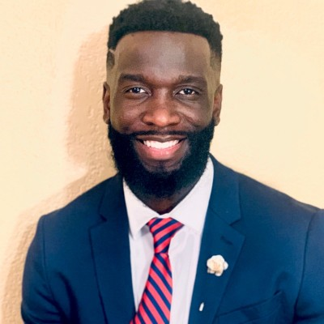

# OOBudgetTracker
# Ferdinad Aguwa - BudgetTracker
## Description
The primary goal of this application is to appeal to clients of all ages and income levels to make their money work for them. Money managemnet is always an extremely hard concept to grasp. With this application whether the user is online or offline they will be able to check and change the status of their account. Good luck, and happy savings.

## Table of Contents
* [License](#license)
* [Pitch](#pitch)
* [Contributing](#contributing)
* [Links](#Links)
* [Tenchnologies](#Technologies)
* [Developer](#Developer)
## License
MIT
## Contributing

## Links
* GitHub repository URL: https://github.com/FerdinadAguwa/OOBudgetTracker
## Technologies
### Languages
* HTML, CSS, JavaScript, JQuery bootstrap
### FrameWorks
* Visual Studio Code
## Page Preview
* Screenshots

## Developer
### Ferdinad Aguwa 
* Github username: FerdinadAguwa
* Email: ferd.aguwa@yahoo.com

